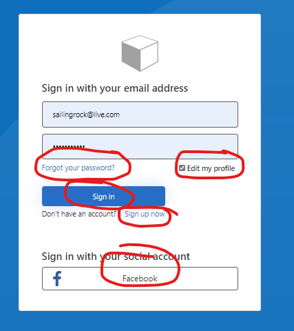

# All in one journey

A single user journey with all the options: signup or sign-in, password reset and/or optionally (user choice on signin) edit attributes. Allows applications to dispense with
having to handle initiation of separate pwd reset and profile edit journeys.

ProfileEdit UI is displayed (always) for new users, optionally based on user selecting a checkbox on the signin screen or if the application
initiates the journey with *profileEdit=true* URL parameter included in the OIDC token request.

Based on the SocialAndLocal starter pack.

Makes use of pre-existing Keep Me Signed In UI and therefore this journey may not be combined with the KMSI functionality.



## Adding sample to your policy set

Use [IefPolicies module](https://www.powershellgallery.com/packages/IefPolicies) with the following commands:

To download a starter pack to the current folder:
```PowerShell
Connect-IefPolicies yourtenantname
New-IefPolicies
```
After replacing *yourtenantname* with the name of your B2C tenant (the *.onmicrosoft.com* suffix is not needed)

To add this sample to the above starter pack
```PowerShell
Add-IefPoliciesSample AllInOne -owner mrochon -repo b2csamples
```

To import to your tenant:
```PowerShell
Import-IefPolicies
```

To remove these policies from your tenant:
```PowerShell
Remove-IefPolicies V1
```
After replacing *'V1'* with the value of the Prefix attribute in the *conf.json* file
