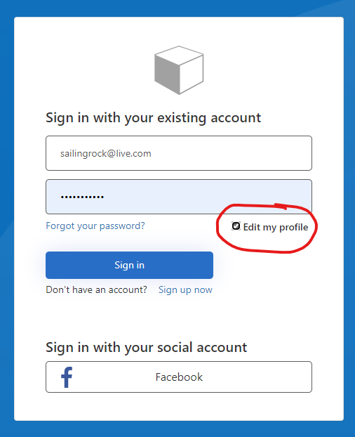

# Include profile edit in Sign up/sign in journey

Allow user to select to edit their B2C profile as part of the signin journey. Profile edit journey is thus
no loner needed.

Based on the SocialAndLocal starter pack.



## Adding sample to your policy set

Use [IefPolicies module](https://www.powershellgallery.com/packages/IefPolicies) with the following commands:

To download a starter pack to the current folder:
```PowerShell
Connect-IefPolicies yourtenantname
New-IefPolicies
```
After replacing *yourtenantname* with the name of your B2C tenant (the *.onmicrosoft.com* suffix is not needed)

To add this sample to the above starter pack
```PowerShell
Add-IefPoliciesSample SUSIWithEdit -owner mrochon -repo b2csamples
```

To import to your tenant:
```PowerShell
Import-IefPolicies
```

To remove these policies from your tenant:
```PowerShell
Remove-IefPolicies V1
```
After replacing *'V1'* with the value of the Prefix attribute in the *conf.json* file
